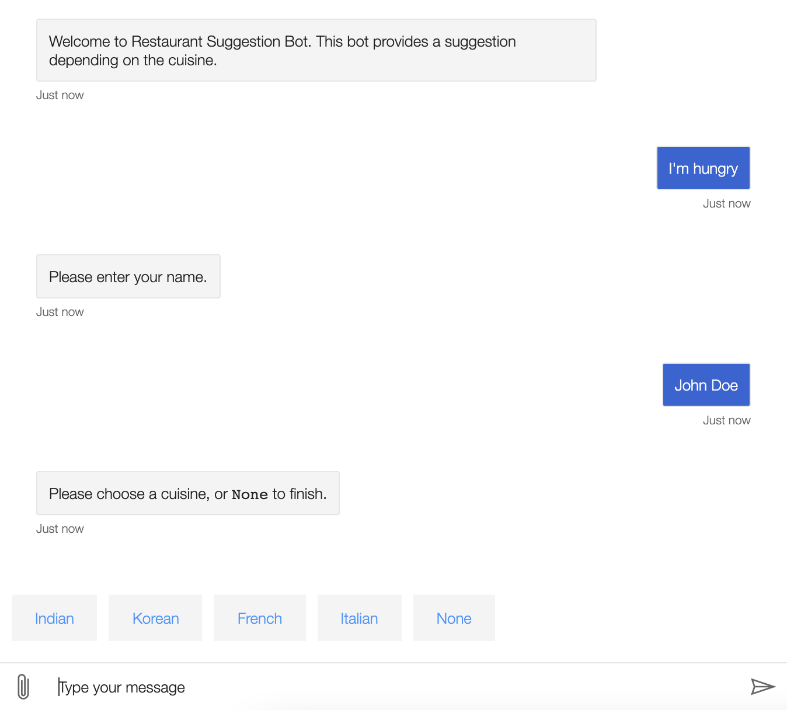
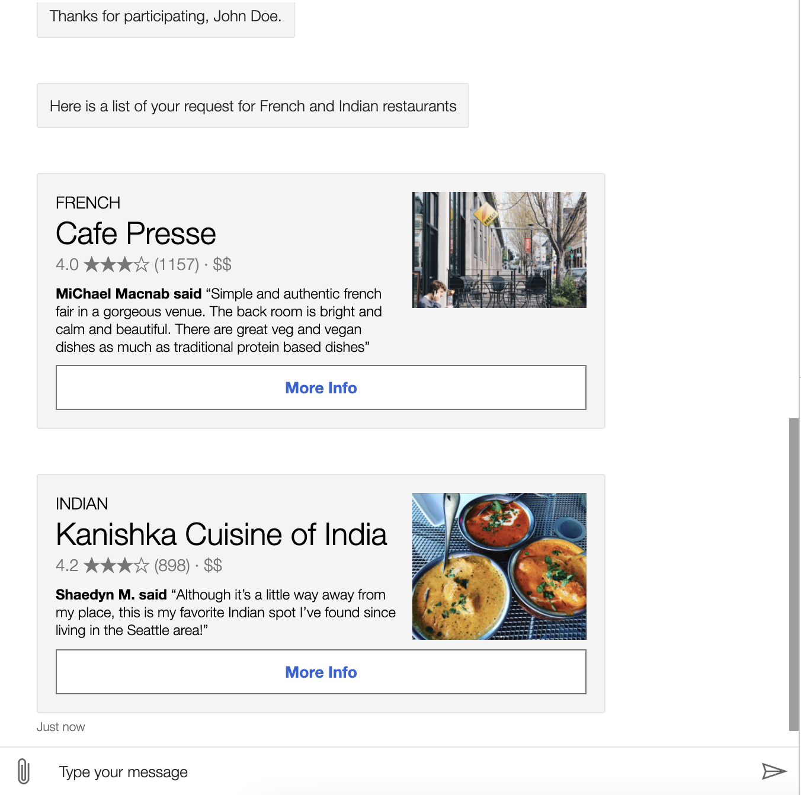

# Restaurant Search Bot
Restaurants Search Bot using Bot Builder Framework & Yelp API

## Screens
  !

## Demo
Check out the demo
- using [Bot Framework Emulator ](https://drive.google.com/file/d/1DLzDwjPa9hGLjwlgbm9023--rD0UBeyE/view?usp=sharing)

## Features
- User can search top-rated restaurants
- User can search restaurants using location and cuisine

## Prerequisites
- Yelp API Key for searching the Restaurants, you can get it [here](https://www.yelp.com/developers/documentation/v3/authentication)
- Microsoft Bot Builder Framework, check the details [here](https://docs.microsoft.com/en-us/azure/bot-service/python/bot-builder-python-quickstart?view=azure-bot-service-4.0#create-a-bot) check the repository [here](https://github.com/microsoft/BotBuilder-Samples)

## How to use
- Clone the repo
- add the YELP API key to `yelpAPI.py` file
- open the terminal in the project directory and run the below commands
  - > pip install -r requirements.txt
  - Once the requirements have been installed you can start up the app
  - > python app.py
  - Start the Emulator and connect the bot
  - > http://localhost:3978/api/messages
  
  
  
  
 **Note**: *While developing this bot, I had issues with the Yelp API. The features aren't currently on this repo. Please check back for the updated repository.*
